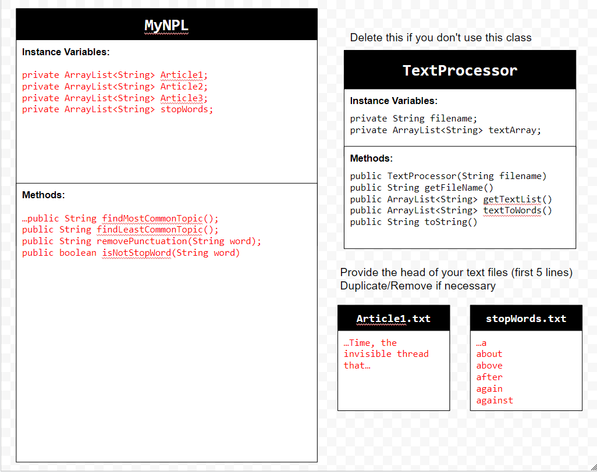
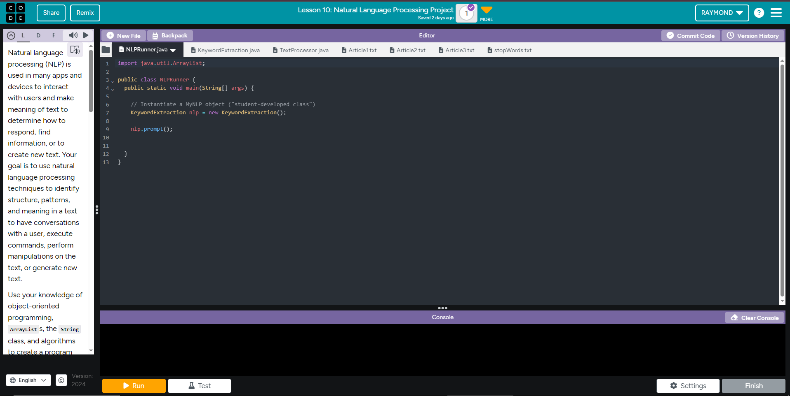

# Unit 6 - Natural Language Processing Project

## Introduction

Natural language processing (NLP) is used in many apps and devices to interact with users and make meaning of text to determine how to respond, find information, or to create new text. Your goal is to use natural language processing techniques to identify structure, patterns, and meaning in a text to have conversations with a user, execute commands, perform manipulations on the text, or generate new text.

## Requirements

Use your knowledge of object-oriented programming, ArrayLists, the String class, and algorithms to create a program that uses natural language processing techniques:

- **Create at least two ArrayLists** – Create at least two ArrayLists to store the data used in your program, such as data from text files or entered by the user.
- **Implement one or more algorithms** – Implement one or more algorithms that use loops and conditionals to find or manipulate elements in an ArrayList or String object.
- **Use methods in the String classs** - Use one or more methods in the String class in your program, such as to divide text into sentences or phrases.
- **Use at least one natural language processing technique** – Use a natural language processing technique to process, analyze, and/or generate text.
- **Document your code** – Use comments to explain the purpose of the methods and code segments and note any preconditions and postconditions.

## UML Diagram

Put and image of your UML Diagram here. Upload the image of your UML Diagram to your repository, then use the Markdown syntax to insert your image here. Make sure your image file name is one word, otherwise it might not properly get display on this README.

## Video

Record a short video of your project to display here on your README. You can do this by:

- Screen record your project running on Code.org.
- Upload that recording to YouTube.
- Take a thumbnail for your image.
- Upload the thumbnail image to your repo.
- Use the following markdown code:

  https://youtu.be/mOodFh-Pm84 

## Project Description

Write a description of the goal and/or problem that your application. Include descriptions of what text is being analyzed, either if its text files you are using to interpret text an how the user interacts with your project.

For our project we decided to make a keyword extraction algorithim. This project's goal is to take the most or least commonly used word in an article. We created a findMostCommonTopic and findLeastCommonTopic to extract the most or least common keywords from our Articles which are stored in seperate text files. Other methods like removePuncuation, and isNotStopWord help make sure we are looking at important words instead of common words that dont add much to the article, aswell as removing punctuation to ensure that two words equal eachother even if one of them has puncuation. Once the code is ran our prompt method promts the user to first pick if they want to find the least or most used word in an article. It then asks them to pick an Article form 1 to 3. Depending on what the user picked it will return the most or least common word aswell as its count from their chosen article.
## NLP Techniques

Write a description of what natural lanugage technique (NLP) you implemented in your project. State which methods in your project are associated with this, and a brief explanation of how those methods word and how they are necessary in the NLP technique. 

In this project we used a keyword extraction technique. Our findMostCommonTopic and findLeastCommonTopic are the main NLP methods and they get the most or least common method from an article. These methods take an Article as an ArrayList and traverses through the Article with each word being an element of the list. It takes the current word and compares it to the rest of the words in the Article and if the current word is equal to the compare word it increases the count on that word. If the word has the highest or lowest count(based on if its findMostCommonTopic, or findLeastCommonTopic) at the end traversing through the Article it becomes the MaxWord or MinWord and the method returns the word that appeared the most and how many times it appeared. These methods are necessary to properly extract the needed keywords from our articles.